# claude-code-readme-card

English | [日本語](./README.ja.md)

Generate a Claude Code-style animated SVG card for your GitHub profile README.
No dependencies — pure Python stdlib, outputs a single self-contained SVG
(animation is plain CSS embedded in the file, so it animates even as an image).

## Example

<picture>
  <source media="(prefers-color-scheme: dark)" srcset="./card-dark.svg">
  <source media="(prefers-color-scheme: light)" srcset="./card-light.svg">
  
</picture>

## Usage

Start from the example profile body, then edit it — this is the text that
appears as the reply, and where your own content goes. `about.md` is
gitignored, so your copy stays yours:

```bash
cp about.example.md about.md
```

Then generate the cards:

```bash
python3 generate_card.py \
  --name "YourName" \
  --org "your-org" \
  --model "Opus 5" \
  --cwd "~/your-project" \
  --prompt "Tell me about yourself" \
  --response-file about.md \
  --theme both \
  --out card.svg
```

`--theme both` writes `card-light.svg` and `card-dark.svg`. The example card
above was generated from `about.example.md`, which demonstrates every piece of
markdown the renderer supports.

### Light / dark switching

GitHub honours `<picture>` with `prefers-color-scheme` inside a README, so a
single embed follows the reader's theme. Markdown image syntax (``)
cannot do this — you need the HTML form:

```html
<picture>
  <source media="(prefers-color-scheme: dark)" srcset="./card-dark.svg">
  <source media="(prefers-color-scheme: light)" srcset="./card-light.svg">
  
</picture>
```

For a single theme, use `--theme light` (or `dark`) and embed it plainly:

```markdown

```

### The response body

`--response` (or `--response-file`) is where you put your own profile content.
It is rendered as the assistant's reply, in a small markdown subset:

| Syntax | Result |
| --- | --- |
| `# Heading` / `## Heading` | Bold, accent-coloured heading |
| `- item` / `* item` | Bullet, with wrapped lines hanging under the text |
| `**bold**` | Bold |
| `` `code` `` | Code-coloured span |
| ` ``` ` fences | Indented code block |
| blank line | Vertical gap |

Long lines wrap on their own, and CJK text wraps per character the way a
terminal does. See `about.example.md` for a worked example of all of the above.

### Options

| Flag | Default | Description |
| --- | --- | --- |
| `--name` | `Guest` | Shown in "Welcome back {name}!" |
| `--org` | `Personal` | Shown in the account line |
| `--model` | `Sonnet 5` | Model name in the account line |
| `--plan` | `Claude Pro` | Plan name in the account line |
| `--cwd` | `~/project` | Path under the welcome message |
| `--title` | `Claude Code` | Text on the box's top border |
| `--prompt` | `Tell me about yourself` | The `❯` user line; wraps, cursor parks at its end |
| `--response` | — | Assistant reply, markdown subset |
| `--response-file` | — | Read `--response` from a file |
| `--tips` | 2 example lines | "Tips for getting started" lines |
| `--whatsnew` | 3 example lines | "What's new" lines |
| `--thinking-word` | `Forming` | Word beside the spinner |
| `--thinking-suffix` | `(esc to interrupt)` | Text after the spinner word |
| `--theme` | `light` | `light`, `dark`, or `both` |
| `--out` | `card.svg` | Output path |

## What animates

All animation is CSS `@keyframes` inside the SVG's own `<style>`, so it plays
even when the SVG is loaded as a plain ``:

- Blinking cursor, parked at the end of the prompt text
- The spinner cycles `·` → `+` → `*` → `✻` → `*` → `+`, opening then closing
  like the CLI's. It is drawn as vector spokes rather than glyphs so it looks
  identical for every viewer regardless of their fonts.
- The mascot idly bobs and occasionally blinks

## Customising the mascot

The mascot is a pixel grid in `generate_card.py` — edit `MASCOT_PIXELS` to
reshape it. Each character is one pixel: `#` body, `S` shaded body, `O` eye,
`.` transparent. The renderer sizes and centres itself to whatever grid you
give it, so rows and columns can be added freely.

